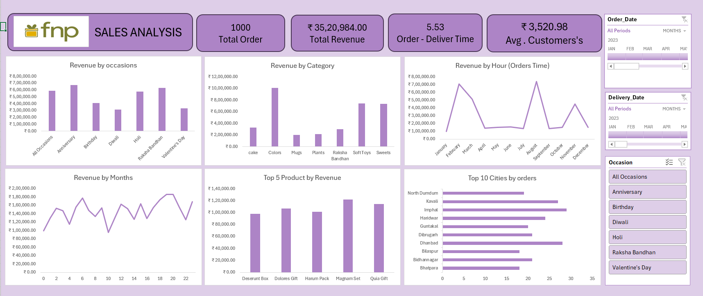

# 📊 Sales Analysis Dashboard | FNP (Ferns N Petals)

An end-to-end **Business Intelligence project** built in **Power BI**, analyzing 1,000+ transactions from Ferns N Petals (FNP) to uncover revenue trends, customer behavior, and operational efficiency across occasions, categories, products, and geographies.

---

## 🧭 Table of Contents

- [Project Overview](#-project-overview)
- [Business Objectives](#-business-objectives)
- [Dataset](#-dataset)
- [Tools & Technologies](#-tools--technologies)
- [Key KPIs](#-key-kpis)
- [Key Insights](#-key-insights)
- [Dashboard Features](#-dashboard-features)
- [Project Workflow](#-project-workflow)
- [Folder Structure](#-folder-structure)
- [How to Use](#-how-to-use)
- [Future Enhancements](#-future-enhancements)
- [Contact](#-contact)

---

## 📌 Project Overview

This project transforms raw FNP sales data into an **interactive Power BI dashboard** designed to help business stakeholders make data-driven decisions around marketing campaigns, inventory planning, and regional expansion.

The dashboard answers critical business questions such as:
- Which occasions and categories drive the most revenue?
- When do customers order the most?
- Which products and cities lead in performance?
- How efficient is the order-to-delivery process?

---

## 🎯 Business Objectives

- Identify **top-performing occasions, categories, and products**.
- Analyze **temporal trends** (monthly, hourly) to optimize campaign timing.
- Discover **high-potential geographic markets** for expansion.
- Measure **operational KPIs** like delivery time and average customer spend.
- Build an interactive, self-service BI tool for stakeholders.

---

## 📂 Dataset

- **Source:** FNP Sales Dataset (sample/educational data)
- **Records:** 1,000 orders
- **Fields include:** Order ID, Order Date, Delivery Date, Occasion, Category, Product, City, Order Time, Revenue, Customer ID

---

## 🛠️ Tools & Technologies

| Category | Tools Used |
|----------|------------|
| **BI & Visualization** | Power BI Desktop |
| **Data Modeling** | Star Schema, Relationships |
| **Calculations** | DAX (Measures, Calculated Columns) |
| **Data Preparation** | Power Query (ETL & Cleaning) |
| **Interactivity** | Slicers, Filters, Drill-throughs |

---

## 📈 Key KPIs

| Metric | Value |
|--------|-------|
| Total Orders | **1,000** |
| Total Revenue | **₹35,20,984** |
| Avg. Order-to-Delivery Time | **5.53 days** |
| Avg. Customer Spend | **₹3,520.98** |

---

## 🔍 Key Insights

🎉 **Occasion-Based Revenue:** Anniversaries, Raksha Bandhan, and Holi emerged as the highest revenue-generating occasions — outperforming traditional favorites like Valentine's Day.

🎁 **Category Performance:** The *Colors* category dominated, followed by Sweets and Soft Toys, indicating clear customer preferences for inventory planning.

⏰ **Temporal Trends:** August recorded the highest order volume, signaling strong festive-season opportunities for targeted campaigns.

🏆 **Top Products:** *Magnum Set* and *Qula Gift* led the top 5 products by revenue.

🌍 **Geographical Reach:** Tier-2 cities like **North Dumdum, Kavali, and Imphal** led order volumes — a strong indicator for regional expansion beyond metros.

---

## 📊 Dashboard Features

- **KPI Cards:** Total Orders, Total Revenue, Avg. Delivery Time, Avg. Customer Spend
- **Revenue by Occasion:** Bar chart highlighting top-performing events
- **Revenue by Category:** Comparative category performance
- **Revenue by Hour & Month:** Time-based trend analysis
- **Top 5 Products by Revenue:** Product-level performance
- **Top 10 Cities by Orders:** Geographic distribution
- **Interactive Filters:** Order Date, Delivery Date, Occasion

---

## 🔄 Project Workflow

1. **Data Collection** — Imported raw FNP sales dataset.
2. **Data Cleaning (Power Query)** — Removed duplicates, handled nulls, standardized formats.
3. **Data Modeling** — Built relationships between fact and dimension tables.
4. **DAX Measures** — Created KPIs, time intelligence, and aggregations.
5. **Visualization** — Designed an interactive, user-friendly dashboard.
6. **Insight Generation** — Translated visual patterns into business recommendations.

---

## 📁 Folder Structure
